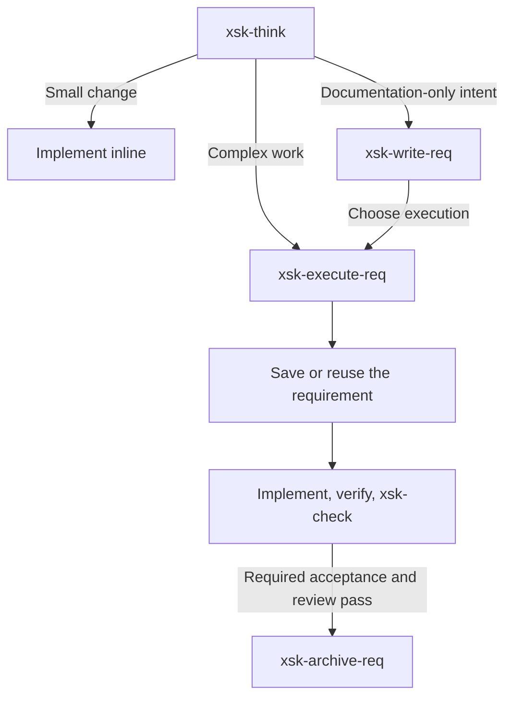

<div align="center">

# xsk

*Plan, implement, and review with a shared set of coding-agent skills.*

[](https://www.npmjs.com/package/@xenonbyte/xsk)
[](https://nodejs.org/)
[](package.json)
[](LICENSE)

[Features](#features) · [Installation](#installation) · [Usage](#usage) · [Skills](#skills) · [Safety](#safety) · [Troubleshooting](#troubleshooting)

**English** | [简体中文](README.zh-CN.md)

</div>

`xsk` (`@xenonbyte/xsk`) provides nine curated skills and a zero-dependency CLI to install them across Claude Code, Codex, opencode, and Gemini. Use the CLI to manage installed files, then use the skills inside your agent to take work from an idea through implementation, review, and archival.

## Features

- **Nine curated skills** for planning, requirements, research, execution, review, and skill-project setup.
- **Four agent targets.** Install the applicable skills into all four platforms or select platforms with `--platform`.
- **A compact execution workflow.** One requirement holds the goal, acceptance criteria, progress, and verification evidence; successful execution archives it automatically.
- **Recorded ownership.** Manifests, markers, and content hashes track installed files and detect user edits. See [Safety](#safety) for details.
- **Zero runtime dependencies.** Node.js >= 20, CommonJS, and no build step.

## Installation

Requires **Node >= 20 on macOS or Linux** and an agent you have already set up.

```sh
npm install -g @xenonbyte/xsk
xsk install --platform claude,codex
xsk status --platform claude,codex
```

The npm command installs the CLI. `xsk install` writes the skills into the selected agents' user directories. Omit `--platform` to target all four platforms. Selection is by platform; there is no per-skill CLI filter.

## Usage

Manage installations from a terminal:

```sh
xsk install                         # all four platforms
xsk status
xsk status --platform codex --json
xsk doctor --platform claude,codex
```

Example status output for this checkout after installing all platforms; the version follows the installed package:

```text
claude: ok (9 skills) v0.4.0
codex: ok (8 skills) v0.4.0
opencode: ok (8 skills) v0.4.0
gemini: ok (8 skills) v0.4.0
```

The non-Claude platforms show 8 skills because `xsk-bypass-claude` is Claude-only.

Inside your project, ask your agent to use a skill by name and describe the task. In [Claude Code](https://code.claude.com/docs/en/skills) and [opencode](https://github.com/anomalyco/opencode/blob/dev/packages/opencode/src/command/index.ts), you can invoke it directly, for example:

```text
/xsk-think Plan an improvement to this project's error messages.
/xsk-check Review the current diff for regressions.
```

Think presents the design and waits for your next-action selection. The agent performs the work; `xsk` itself has no `run` command.

## Commands

| Command | Purpose |
|---|---|
| `xsk install [--platform <list>]` | Generate and install skills. Reinstall first uninstalls the prior owned state, then regenerates it; edited owned files are refused. |
| `xsk uninstall [--platform <list>]` | Remove recorded, verified owned files and restore displaced backups when possible. |
| `xsk status [--platform <list>] [--json]` | Read-only report: `ok`, `drift`, `invalid`, or `not-installed`. |
| `xsk doctor [--platform <list>] [--json]` | Check Node version, target-directory writability, and manifest health, including drift. |
| `xsk version` (also `--version` / `-v`) | Print the package version. |
| `xsk help` (also `--help` / `-h`, or no arguments) | Print the command list. |

`--platform` accepts a comma-separated list of `claude`, `codex`, `opencode`, and `gemini`; it defaults to all four. Unknown options, unknown platforms, and duplicate platform names are rejected.

| Exit code | Meaning |
|---|---|
| `0` | Command completed. For `status`, this means the report was produced; inspect its states to determine health. |
| `1` | Invalid input, an operation failure, or a failed `doctor` check. |
| `2` | Partial uninstall. Inspect the retained/refused paths and any recovery error before retrying. |

`doctor` checks local installation prerequisites and records. It does not verify that an agent has discovered a skill or followed its instructions.

## Skills

Nine skills, prefixed `xsk-`. Follow a skill link to read its complete instructions:

| Skill | Purpose |
|---|---|
| [xsk-think](skills/think/SKILL.md) | Develop a grounded design, resolve important choices, and offer concrete next actions. |
| [xsk-write-req](skills/write-req/SKILL.md) | Save a requirement in `.xsk/requirements/` without starting implementation. |
| [xsk-execute-req](skills/execute-req/SKILL.md) | Implement an active requirement or a think plan explicitly routed here, verify and review it, then archive on success. |
| [xsk-check](skills/check/SKILL.md) | Review the actual change, check scope and safety, and report findings backed by evidence. |
| [xsk-point](skills/point/SKILL.md) | Research one aspect and save its evidence and confirmed conclusion in `.xsk/points/`. |
| [xsk-consume-point](skills/consume-point/SKILL.md) | Fold selected point conclusions into one requirement and archive fully consumed points. |
| [xsk-archive-req](skills/archive-req/SKILL.md) | Manually archive the active requirement, including cancelled or superseded work. |
| [xsk-skill-scaffold](skills/skill-scaffold/SKILL.md) | Audit an agent-skill project against the xsk standard and propose applicable changes. |
| [xsk-bypass-claude](skills/bypass-claude/SKILL.md) | Enable automatic tool approval for the current Claude Code project via `.claude/settings.local.json`. Claude only. |

`xsk-think` and `xsk-check` are distilled from [Waza](https://github.com/tw93/Waza). `xsk-bypass-claude` is skipped on non-Claude platforms and refuses to act outside Claude Code, even if another agent discovers it through an alias.

### Choosing a skill

Start with `xsk-think` when the approach needs discussion, `xsk-write-req` when you want a saved specification, or `xsk-execute-req` when a requirement is ready to implement. Use `xsk-check` to review an existing change; standalone reviews are read-only.



- **Keep small work small.** Think's inline execution choice stays in normal conversation, even if an unrelated active requirement exists. Ready work offers exactly two choices: the applicable execution or documentation route, and revision; unresolved questions and no-change conclusions do not start implementation.
- **Keep one execution document.** The requirement contains Goal, Scope, Acceptance, and a compact Execution section. A separate PLAN is added only when explicitly requested or required by the project. Existing decisions and valid checks are reused; unresolved material changes pause only the affected work. Incomplete work stays active with its remaining steps. If only archival fails, preserve the evidence and retry that step.
- **Keep research reusable.** Use `xsk-point`, then choose `xsk-consume-point` to incorporate confirmed conclusions through writer. Partial adoption leaves the remainder active. Consumption must finish before execution is offered; new archives use create-only writes and both files are checked again before source removal. Conflicts preserve recoverable files for reconciliation.

Selecting requirement execution authorizes saving the stated requirement, implementation, verification, and automatic archival. It does not by itself authorize Git commits, real installations, pushes, or publication. Internal writer, checker, and archiver calls return to the executor without extra next-action menus.

## How it works

The [registry](lib/skills.js), per-skill fragments, and [shared conventions](shared/skill-common.md) generate one platform-neutral `SKILL.md` per skill. Installation writes the applicable skills, `.xsk-owned` ownership markers, content hashes, and a manifest for each selected platform. opencode command files are tracked by manifest and hash without a marker.

Installer state and project workflow documents have different locations:

| Location | Contents |
|---|---|
| `~/.xsk/manifests/<platform>.manifest` | Installed paths, hashes, and backup records. |
| `~/.xsk/install/backups/<platform>/` | User skill files displaced during installation. |
| `.xsk/requirements/` in your project | At most one active requirement; completed or manually closed records go under `archive/`. |
| `.xsk/points/` in your project | Active research points; consumed or dropped points go under `archive/`. |

The skills manage the project's `.xsk/` documents; the installer manages the user-level installation state. Archives are ignored through `.xsk/.gitignore` by default. They are local records and need separate preservation to survive a fresh clone; adding ignore rules does not untrack files already in Git. An archived status alone does not prove implementation is complete.

## Platforms

`<name>` below is the full skill name, such as `xsk-think`.

| Platform | Install location |
|---|---|
| Claude Code | `~/.claude/skills/<name>/SKILL.md` |
| Codex | `~/.agents/skills/<name>/SKILL.md` |
| opencode | `~/.config/opencode/skills/<name>/SKILL.md` and `~/.config/opencode/commands/<name>.md` |
| Gemini | `~/.gemini/skills/<name>/SKILL.md` |

For example, opencode receives `commands/xsk-think.md`, invocable as `/xsk-think`. Skill and command files are both tracked for uninstall.

## Discovery aliases and duplicate skills

[opencode's discovery rules](https://github.com/anomalyco/opencode/blob/dev/packages/web/src/content/docs/skills.mdx) also include `~/.claude/skills/` and `~/.agents/skills/`. [Gemini CLI](https://github.com/google-gemini/gemini-cli/blob/main/docs/cli/using-agent-skills.md) also discovers the `~/.agents/skills/` alias.

One platform's copy can therefore be visible to another agent. xsk keeps independently tracked copies for each selected platform; it does not deduplicate across discovery aliases. Uninstalling one platform's copy may leave a skill visible through another location. Check the host agent's discovery rules when diagnosing duplicates.

## Safety

- **Ownership and drift checks.** Removal is limited to recorded paths with valid ownership evidence. Modified owned skills and commands are retained; reinstall refuses to overwrite them.
- **Path checks.** Symlinks and non-directory ancestors are refused. Markerless user directories are not adopted as owned directories.
- **Atomic publication.** Generated installation files, manifests, and rollback file replacements use an exclusive temporary sibling followed by rename. Rollback leaves matching file contents in place and stages replacements before publication.
- **Restoration and partial results.** Successful backup restoration relinquishes ownership of the user file and directory. I/O failures are reported with retained records; operational reset errors stop reinstall. Rollback errors name the paths whose recovery failed.

The installer writes under `~/.xsk/`, the selected platform skill directories, and opencode's command directory. Skills that implement requirements can modify your project according to the work you authorize.

## Troubleshooting

| Symptom | What to check |
|---|---|
| Skill is missing in the agent | Run `xsk status --platform <platform> --json`, inspect its install path, then refresh the host's skill list. Gemini CLI supports `/skills list` and `/skills reload`. |
| `drift` | Inspect the paths reported by `status --json`: content, types, markers, or backups may differ from their recorded state. Preserve user edits before resolving the difference. |
| `invalid` | Inspect the reported manifest error and retain the manifest and backups for diagnosis. Reinstall refuses invalid manifests. |
| Partial uninstall or `rollback failed` | Inspect the reported paths and retained files, resolve the filesystem problem, then retry the unfinished operation. |
| A skill appears more than once | Check [discovery aliases](#discovery-aliases-and-duplicate-skills) and which copies your agent loads. |

The Gemini commands are documented in its [skills tutorial](https://github.com/google-gemini/gemini-cli/blob/main/docs/cli/tutorials/skills-getting-started.md).

## Development

From a checkout, run the CLI with `node bin/xsk.js help`. No dependency installation or build step is needed for the project checks:

```sh
npm test
npm run syntaxcheck
npm pack --dry-run
```

| Source | Role |
|---|---|
| `bin/`, `lib/` | CLI dispatch, generation, platform adapters, manifests, installation, and diagnostics. |
| `templates/fragments/`, `shared/` | Authoritative skill instructions and common conventions. |
| `skills/`, `test/fixtures/golden/` | Generated skills and masked snapshots. Regenerate both after changing their inputs. |
| `test/`, `scripts/` | Regression tests, workflow evaluation cases, and syntax checks. |

See [AGENTS.md](AGENTS.md) or [CLAUDE.md](CLAUDE.md) for generation instructions and test isolation rules. The project checks its own scaffold standard in `test/self-conformance.test.js`. Tests use temporary agent roots; source tests and fixture evaluations do not certify real installed-agent behavior.
