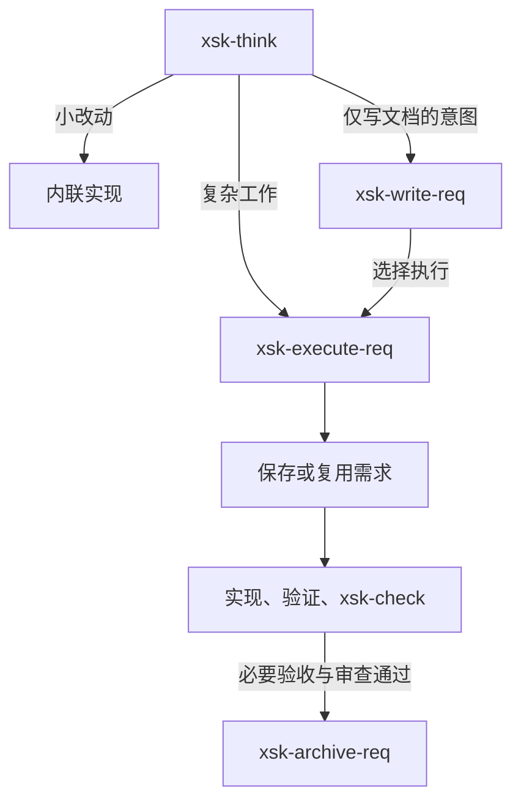

<div align="center">

# xsk

*在多个编程 agent 中复用规划、实现与审查流程。*

[](https://www.npmjs.com/package/@xenonbyte/xsk)
[](https://nodejs.org/)
[](package.json)
[](LICENSE)

[Features](#features) · [Installation](#installation) · [Usage](#usage) · [Skills](#skills) · [Safety](#safety) · [Troubleshooting](#troubleshooting)

[English](README.md) | **简体中文**

</div>

`xsk`（`@xenonbyte/xsk`）提供九个精选技能和一个零依赖 CLI，可安装到 Claude Code、Codex、opencode 与 Gemini。用 CLI 管理安装文件，再在 agent 中使用技能，将想法推进到实现、审查和归档。

## Features

- **九个精选技能**，覆盖规划、需求、研究、执行、审查和技能项目搭建。
- **四个平台。** 安装各平台适用的技能，也可通过 `--platform` 选择目标平台。
- **精简的执行流程。** 一份需求记录目标、验收条件、进度和验证证据，执行成功后自动归档。
- **可追踪的文件所有权。** manifest、标记和内容哈希记录安装文件并识别用户改动；详情见 [Safety](#safety)。
- **零运行时依赖。** Node.js >= 20、CommonJS，无构建步骤。

## Installation

需要 **macOS 或 Linux 上的 Node >= 20**，以及已经配置好的 agent。

```sh
npm install -g @xenonbyte/xsk
xsk install --platform claude,codex
xsk status --platform claude,codex
```

npm 命令安装 CLI；`xsk install` 把技能写入所选 agent 的用户目录。省略 `--platform` 时安装到全部四个平台。CLI 按平台选择，不提供单个技能的筛选参数。

## Usage

在终端中管理安装：

```sh
xsk install                         # 全部四个平台
xsk status
xsk status --platform codex --json
xsk doctor --platform claude,codex
```

以下是本 checkout 安装全部平台后的状态输出示例；版本号取决于已安装的 package：

```text
claude: ok (9 skills) v0.4.0
codex: ok (8 skills) v0.4.0
opencode: ok (8 skills) v0.4.0
gemini: ok (8 skills) v0.4.0
```

非 Claude 平台显示 8 个技能，因为 `xsk-bypass-claude` 仅面向 Claude。

在项目中，按名称请 agent 使用技能，并描述任务。在 [Claude Code](https://code.claude.com/docs/en/skills) 与 [opencode](https://github.com/anomalyco/opencode/blob/dev/packages/opencode/src/command/index.ts) 中可以直接调用，例如：

```text
/xsk-think 规划如何改进本项目的错误提示。
/xsk-check 检查当前 diff 是否引入回归。
```

think 给出方案后等待你选择下一步。实际工作由 agent 执行，`xsk` 本身没有 `run` 命令。

## Commands

| Command | Purpose |
|---|---|
| `xsk install [--platform <list>]` | 生成并安装技能。重装会先卸载此前拥有的文件，再重新生成；用户修改过的 owned 文件会被拒绝覆盖。 |
| `xsk uninstall [--platform <list>]` | 移除记录在案、所有权验证通过的文件，并在可恢复时还原被替换文件的备份。 |
| `xsk status [--platform <list>] [--json]` | 只读报告：`ok`、`drift`、`invalid` 或 `not-installed`。 |
| `xsk doctor [--platform <list>] [--json]` | 检查 Node 版本、目标目录可写性和 manifest 健康状况，包括漂移。 |
| `xsk version`（亦作 `--version` / `-v`） | 打印 package version。 |
| `xsk help`（亦作 `--help` / `-h`，或不传参数） | 打印命令清单。 |

`--platform` 接受由逗号分隔的 `claude`、`codex`、`opencode`、`gemini`，默认全部四个平台。未知选项、未知平台及重复的平台名称均会被拒绝。

| Exit code | Meaning |
|---|---|
| `0` | 命令完成。对 `status` 而言，仅表示已生成报告；健康状况需看报告中的状态。 |
| `1` | 输入不合法、操作失败，或 `doctor` 检查未通过。 |
| `2` | 卸载部分完成。重试前先查看保留或拒绝处理的路径，以及恢复错误。 |

`doctor` 检查本地安装条件和记录，不验证 agent 是否已发现技能或遵循了技能指令。

## Skills

共九个技能，统一前缀 `xsk-`。点击名称可阅读完整指令：

| Skill | Purpose |
|---|---|
| [xsk-think](skills/think/SKILL.md) | 基于项目证据整理方案、解决重要选择，并给出具体的下一步选项。 |
| [xsk-write-req](skills/write-req/SKILL.md) | 把需求保存到 `.xsk/requirements/`，暂不开始实现。 |
| [xsk-execute-req](skills/execute-req/SKILL.md) | 实现 active 需求或明确交给本技能的 think 方案，验证、审查后自动归档。 |
| [xsk-check](skills/check/SKILL.md) | 审查实际改动、范围和安全边界，报告有证据支持的问题。 |
| [xsk-point](skills/point/SKILL.md) | 深入研究一个方面，将证据和确认后的结论保存到 `.xsk/points/`。 |
| [xsk-consume-point](skills/consume-point/SKILL.md) | 将选定 point 的结论整合为一份需求，归档完整采纳的 point。 |
| [xsk-archive-req](skills/archive-req/SKILL.md) | 手动归档 active 需求，包括取消或被替代的工作。 |
| [xsk-skill-scaffold](skills/skill-scaffold/SKILL.md) | 按 xsk 标准检查 agent-skill 项目，提出适用的改进。 |
| [xsk-bypass-claude](skills/bypass-claude/SKILL.md) | 通过 `.claude/settings.local.json` 为当前 Claude Code 项目启用工具自动审批，仅面向 Claude。 |

`xsk-think` 与 `xsk-check` 蒸馏自 [Waza](https://github.com/tw93/Waza)。`xsk-bypass-claude` 不安装到其他平台，即使被其他 agent 通过别名目录发现，也会拒绝在 Claude Code 之外执行。

### Choosing a skill

方案需要讨论时使用 `xsk-think`；只想保存说明时使用 `xsk-write-req`；需求已准备好实现时使用 `xsk-execute-req`。已有改动可交给 `xsk-check`，独立审查保持只读。



- **小任务保持简单。** 选择 think 的内联执行后，在正常对话中实施，即使已有无关 active 需求也不改道。就绪的方案恰好提供两个选项：当前适用的执行或写文档路径，以及调整方案；未决问题和无需修改的结论不会触发实现。
- **执行只维护一份文档。** 需求包含 Goal、Scope、Acceptance 和精简的 Execution 段，只有用户明确要求或项目规定时，才另建 PLAN。复用已有决策和有效验证；实质性变更尚未决定时，只暂停受影响的工作。未完成工作保持 active 并记录剩余步骤；若只剩归档失败，保留证据并重试该步骤。
- **研究结论可以复用。** 使用 `xsk-point`，确认结论后选择 `xsk-consume-point`，由 writer 整合进需求。部分采纳时保留剩余内容；完成消费后才提供执行选项。新归档不得覆盖已有文件，删除源文件前再次核对双方；发生冲突时保留可恢复的文件并协调差异。

选择需求执行授权的是已说明的需求保存、实现、验证和自动归档，本身不授权 Git 提交、真实安装、推送或发布。内部 writer、checker、archiver 完成后返回执行器，不插入额外的下一步菜单。

## How it works

[技能注册表](lib/skills.js)、各技能片段和[共享约定](shared/skill-common.md) 共同生成平台中立的 `SKILL.md`。安装时写入适用的技能、`.xsk-owned` 所有权标记、内容哈希，以及每个平台的 manifest。opencode 命令文件由 manifest 和哈希跟踪，不带所有权标记。

安装状态与项目工作流文档存放在不同位置：

| Location | Contents |
|---|---|
| `~/.xsk/manifests/<platform>.manifest` | 安装路径、哈希和备份记录。 |
| `~/.xsk/install/backups/<platform>/` | 安装时被替换的用户技能文件。 |
| 项目内的 `.xsk/requirements/` | 最多一份 active 需求；完成或手动结束的记录进入 `archive/`。 |
| 项目内的 `.xsk/points/` | 活跃研究 point；已消费或丢弃的 point 进入 `archive/`。 |

技能管理项目内的 `.xsk/` 文档，安装器管理用户级安装状态。归档默认通过 `.xsk/.gitignore` 忽略，是本地记录；要在新 clone 中恢复，需另行保存。新增忽略规则不会取消 Git 已有的文件跟踪。archived 状态本身不证明实现已经完成。

## Platforms

下方 `<name>` 表示完整技能名，例如 `xsk-think`。

| Platform | Install location |
|---|---|
| Claude Code | `~/.claude/skills/<name>/SKILL.md` |
| Codex | `~/.agents/skills/<name>/SKILL.md` |
| opencode | `~/.config/opencode/skills/<name>/SKILL.md` 和 `~/.config/opencode/commands/<name>.md` |
| Gemini | `~/.gemini/skills/<name>/SKILL.md` |

例如，opencode 会获得 `commands/xsk-think.md`，可通过 `/xsk-think` 调用。技能文件与命令文件都会被记录，以供卸载处理。

## Discovery aliases and duplicate skills

[opencode 的发现规则](https://github.com/anomalyco/opencode/blob/dev/packages/web/src/content/docs/skills.mdx) 还包含 `~/.claude/skills/` 和 `~/.agents/skills/`。[Gemini CLI](https://github.com/google-gemini/gemini-cli/blob/main/docs/cli/using-agent-skills.md) 也会发现 `~/.agents/skills/` 别名目录。

因此，一个平台的副本可能被另一个 agent 看见。xsk 为每个所选平台独立记录副本，不跨发现别名去重。卸载某个平台的副本后，技能仍可能通过其他位置被发现；排查重复技能时，请核对 agent 自身的发现规则。

## Safety

- **所有权与漂移检查。** 仅移除记录在案且所有权证据有效的路径。用户修改过的 owned 技能和命令文件会被保留，重装会拒绝覆盖。
- **路径检查。** 拒绝 symlink 和非目录祖先路径；无 marker 的用户目录不会被接管为 owned 目录。
- **原子写入。** 生成的安装文件、manifest 和回滚中的文件替换都先写入排他创建的临时同级文件，再 rename 到目标。回滚时保留内容相符的文件，需要替换时先完成临时文件写入。
- **恢复与部分完成。** 备份恢复成功后，解除对用户文件及目录的所有权。I/O 失败会报告并保留相关记录，重装在重置阶段发生操作错误时停止；回滚失败会指出恢复失败的路径。

安装器写入 `~/.xsk/`、所选平台的技能目录，以及 opencode 命令目录。执行需求的技能则会依据你授权的工作修改项目。

## Troubleshooting

| Symptom | What to check |
|---|---|
| agent 中找不到技能 | 运行 `xsk status --platform <platform> --json`，检查安装路径，再刷新 agent 的技能列表。Gemini CLI 支持 `/skills list` 和 `/skills reload`。 |
| `drift` | 检查 `status --json` 报告的路径：内容、类型、标记或备份可能与记录不符。处理差异前先保留用户改动。 |
| `invalid` | 查看报告中的 manifest 错误，保留 manifest 和备份以供诊断。重装会拒绝无效 manifest。 |
| 卸载部分完成或 `rollback failed` | 检查报错路径和保留文件，解决文件系统问题后，重试未完成的操作。 |
| 同一个技能出现多次 | 检查[发现别名](#discovery-aliases-and-duplicate-skills)及 agent 实际加载的副本。 |

Gemini 命令的用法见其[技能教程](https://github.com/google-gemini/gemini-cli/blob/main/docs/cli/tutorials/skills-getting-started.md)。

## Development

在 checkout 中可通过 `node bin/xsk.js help` 运行 CLI。以下项目检查无需安装依赖或执行构建：

```sh
npm test
npm run syntaxcheck
npm pack --dry-run
```

| Source | Role |
|---|---|
| `bin/`、`lib/` | CLI 分派、生成器、平台适配、manifest、安装和诊断。 |
| `templates/fragments/`、`shared/` | 技能指令与共享约定的权威来源。 |
| `skills/`、`test/fixtures/golden/` | 生成的技能及掩码快照；修改输入后应同步重新生成。 |
| `test/`、`scripts/` | 回归测试、工作流评估场景和语法检查。 |

生成方法和测试隔离规则见 [AGENTS.md](AGENTS.md) 或 [CLAUDE.md](CLAUDE.md)。项目通过 `test/self-conformance.test.js` 检查自身是否符合 scaffold 标准。测试使用临时 agent 目录；源码测试和隔离流程评估不代表真实 agent 环境已通过验证。
